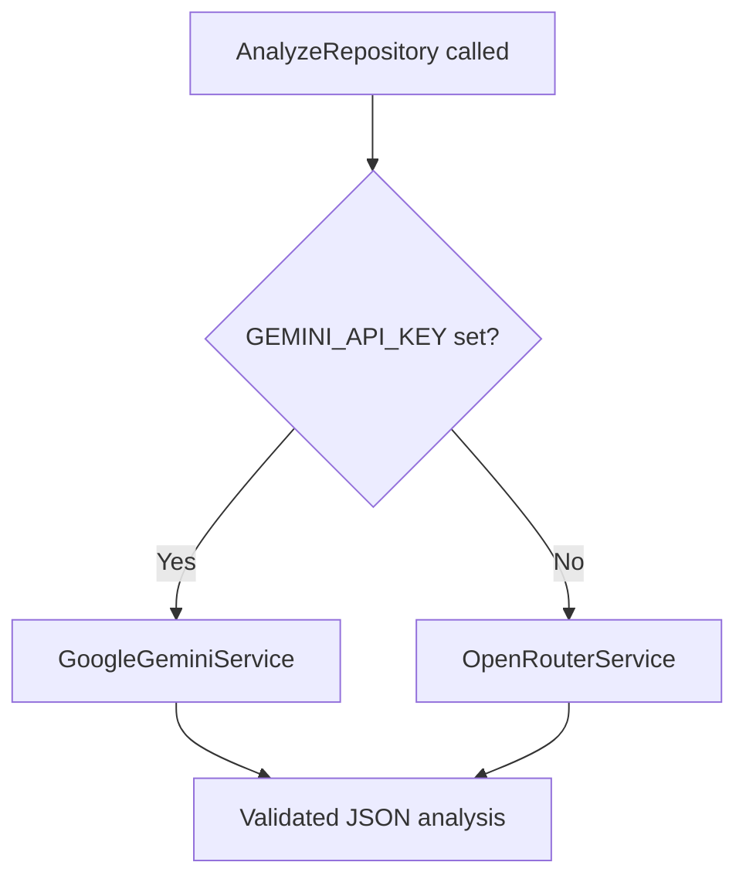

# AI Providers

GitRadar supports two AI backends for repository analysis. Provider selection is **automatic** — there is no `AI_PROVIDER` switch and no Groq integration.

## Selection Logic



Implementation (`App\Services\AiAnalysisService`):

```php
private function usesGemini(): bool
{
    return (string) config('gemini.api_key', '') !== '';
}

public function providerName(): string
{
    return $this->usesGemini() ? 'gemini' : 'openrouter';
}
```

## Decision Table

| Condition | Provider | Config file |
|-----------|----------|-------------|
| `GEMINI_API_KEY` is non-empty | Google Gemini (direct API) | `config/gemini.php` |
| `GEMINI_API_KEY` is empty/missing | OpenRouter | `config/openrouter.php` |

## Recommended Setup

**Production:** Set `GEMINI_API_KEY` for direct Gemini access with structured JSON schema enforcement.

**Development / fallback:** Leave `GEMINI_API_KEY` empty and set `OPENROUTER_API_KEY` to use the free-model fallback chain.

You only need **one** provider configured. If both keys are set, Gemini takes precedence.

## What Is NOT Supported

| Feature | Status |
|---------|--------|
| `AI_PROVIDER=gemini/openrouter/groq` | Not implemented |
| Groq API | Not implemented (zero code references) |
| Per-user provider choice | Not implemented |
| Multiple simultaneous providers | Not implemented — one provider per request |

## Shared Implementation

Both providers use shared traits:

- `BuildsAnalysisPrompts` — same prompt structure from repo name, description, language, stars, README
- `ParsesAndValidatesAnalysisResponses` — JSON extraction, validation, error typing

Gemini additionally uses `responseSchema` in `config/gemini.php` for native structured output.

OpenRouter uses chat completions with JSON parsing strategies and a model fallback chain.

## Health Endpoint Behavior

`GET /health/ai` (authenticated):

- **Gemini active:** runs `GoogleGeminiService::healthCheck()` with model availability
- **OpenRouter active:** returns configured/misconfigured based on `OPENROUTER_API_KEY`

## Switching Providers

1. Add or remove `GEMINI_API_KEY` in `.env`
2. Run `php artisan config:clear`
3. **Restart queue worker** (workers cache config at boot)

## Related Docs

- [gemini-integration.md](gemini-integration.md)
- [openrouter-integration.md](openrouter-integration.md)
- [environment.md](environment.md)
- [ai-analysis.md](ai-analysis.md)
