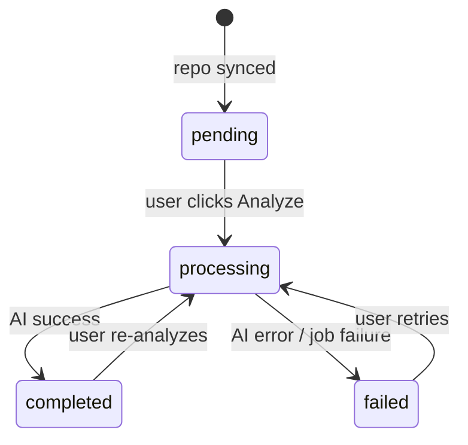
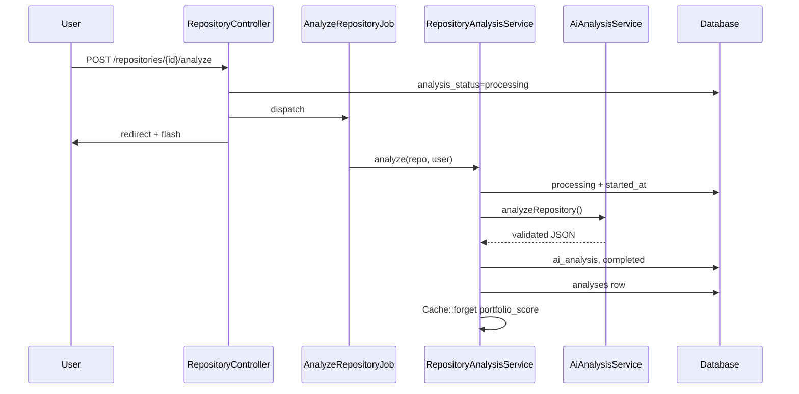

# Analysis Pipeline

End-to-end flow from user action to persisted AI results.

## State Machine

Repository `analysis_status` values:



Stale processing: if `processing` for >5 minutes (or missing `analysis_started_at`), re-analysis is allowed.

## Pipeline Diagram



## Components

### 1. Controller (`RepositoryController::analyze`)

- Authorizes via `RepositoryPolicy`
- Blocks duplicate runs unless stale
- Sets initial `processing` state
- Dispatches `AnalyzeRepositoryJob`

### 2. Job (`AnalyzeRepositoryJob`)

| Property | Value |
|----------|-------|
| Timeout | 300s |
| Tries | 1 |

On failure: if still `processing`, marks `failed` and creates/updates `Analysis` with error message.

### 3. Orchestrator (`RepositoryAnalysisService`)

**Single source of truth** for:

- Status transitions
- Writing `ai_analysis` / `ai_analyzed_at`
- Creating/updating `analyses` records
- Cache invalidation

Never writes a fake score on failure.

### 4. AI layer (`AiAnalysisService` → Gemini or OpenRouter)

- Builds prompt from repo fields
- Calls provider API
- Parses and validates JSON
- Strips internal metadata before persistence

Internal metadata fields (removed before save):

- `_model_used`, `_raw_response`, `_request_id`
- `_prompt_tokens`, `_completion_tokens`, `_total_tokens`

### 5. Polling (`RepositoryController::analysisStatus`)

JSON response for frontend polling:

```json
{
  "status": "completed",
  "is_analyzed": true,
  "is_analyzing": false,
  "has_failed": false,
  "score": 82,
  "failure_message": null,
  "analyzed_at": "2026-08-11T10:30:00+00:00"
}
```

## Portfolio Aggregation

After successful analysis, `portfolio_score_{user_id}` cache is cleared.

Dashboard, Analysis, Insights, and Profile pages recompute via `PortfolioScoreService::assess()`.

Manual refresh: POST `/analysis/run` (recomputes cache from existing analyses — does not call AI).

## Exception Types

See `App\Exceptions\AnalysisException` for full list. Each failure stores `[ERROR_TYPE]` suffix in `analyses.error_message` for support debugging.

## Related Docs

- [ai-analysis.md](ai-analysis.md)
- [ai-providers.md](ai-providers.md)
- [database.md](database.md)
