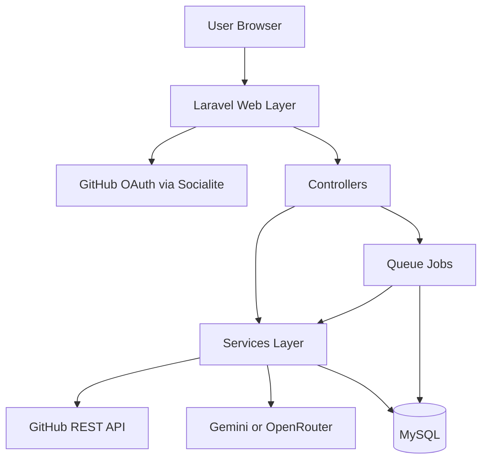
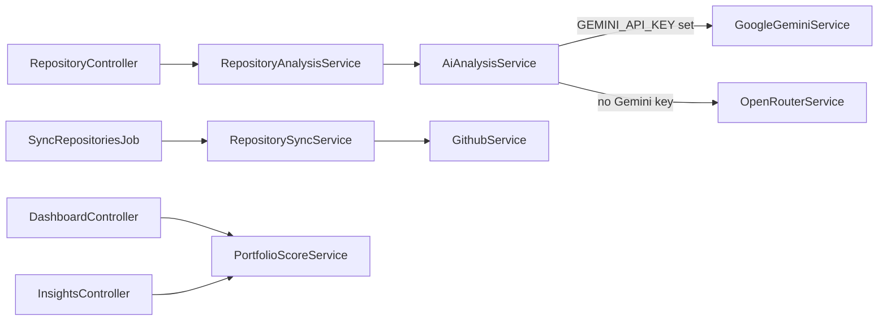

# Architecture

GitRadar is a monolithic Laravel 13 application. All routes are web-based (Blade views); there is no REST API surface for third-party clients.

## High-Level Flow

## Request Lifecycle

1. **Public landing** (`/`) — unauthenticated users see the marketing page.
2. **OAuth** — user clicks “Sign in with GitHub”; Socialite redirects to GitHub and back.
3. **Post-login sync** — `SyncRepositoriesJob` runs after the OAuth redirect (via `dispatchAfterResponse`).
4. **Dashboard** — user sees synced repositories and cached portfolio assessment.
5. **AI analysis** — user triggers analysis on a repository; `AnalyzeRepositoryJob` runs on the queue.
6. **Results** — analysis is persisted on `repositories.ai_analysis` and in the `analyses` table; portfolio cache is invalidated.

## Layer Responsibilities

| Layer | Location | Role |
|-------|----------|------|
| Controllers | `app/Http/Controllers/` | HTTP entry points, authorization, view/redirect responses |
| Policies | `app/Policies/` | Repository ownership checks |
| Models | `app/Models/` | Eloquent entities and scopes |
| Services | `app/Services/` | Business logic (GitHub, sync, AI, scoring) |
| Jobs | `app/Jobs/` | Async sync and AI analysis |
| Views | `resources/views/` | Blade templates + Alpine.js |
| Config | `config/` | GitHub, Gemini, OpenRouter, queue, cache |

## Core Services

### Service summary

| Service | Purpose |
|---------|---------|
| `GithubService` | GitHub REST API (repos, README, profile) |
| `RepositorySyncService` | Upsert repositories and refresh profile metadata |
| `AiAnalysisService` | Route to Gemini or OpenRouter based on config |
| `GoogleGeminiService` | Direct Gemini API with structured JSON schema |
| `OpenRouterService` | OpenRouter chat completions with model fallback chain |
| `RepositoryAnalysisService` | Orchestrate analysis state machine and persistence |
| `PortfolioScoreService` | Weighted portfolio score from analyzed repos |

Shared AI concerns live in traits under `app/Services/Concerns/`:

- `BuildsAnalysisPrompts` — prompt construction from repo metadata + README
- `ParsesAndValidatesAnalysisResponses` — JSON parsing and schema validation

## Queue Jobs

| Job | Timeout | Tries | Trigger |
|-----|---------|-------|---------|
| `SyncRepositoriesJob` | 180s | 2 | OAuth callback, Settings sync |
| `AnalyzeRepositoryJob` | 300s | 1 | Repository “Analyze with AI” action |

**Important:** `DB_QUEUE_RETRY_AFTER` (default 330) must exceed `AnalyzeRepositoryJob` timeout (300) so Laravel does not re-release a still-running job.

## Authorization Model

- Authentication is session-based (Laravel default).
- `RepositoryPolicy` ensures users can only view/analyze/update their own repositories (via `github_account.user_id`).
- No multi-tenant API keys or role system.

## Caching

| Key | TTL | Invalidated when |
|-----|-----|------------------|
| `portfolio_score_{user_id}` | 600s | Sync, analysis complete/fail, manual refresh |
| `openrouter.models` | 3600s | Model catalog fetch (OpenRouter only) |

## Frontend Architecture

- **Vite** bundles `resources/css/app.css` and `resources/js/app.js`.
- **Tailwind CSS 4** via `@tailwindcss/vite`.
- **Alpine.js** for interactive UI (theme switcher, sidebar, soft-search polling).
- **Blade components** in `resources/views/components/` (layout, sidebar, cards).

## Configuration Files

| File | Purpose |
|------|---------|
| `config/services.php` | GitHub OAuth credentials |
| `config/gemini.php` | Gemini models, timeouts, response schema |
| `config/openrouter.php` | OpenRouter models, fallback chain, budgets |
| `config/queue.php` | Database/redis/failover queue drivers |
| `config/cache.php` | File/redis/failover cache drivers |

## Testing

PHPUnit tests cover services, feature flows, and policies. See [testing.md](testing.md).

## Related Docs

- [database.md](database.md) — schema and relationships
- [analysis-pipeline.md](analysis-pipeline.md) — AI state machine
- [repository-sync.md](repository-sync.md) — sync job details
- [api.md](api.md) — web routes reference
