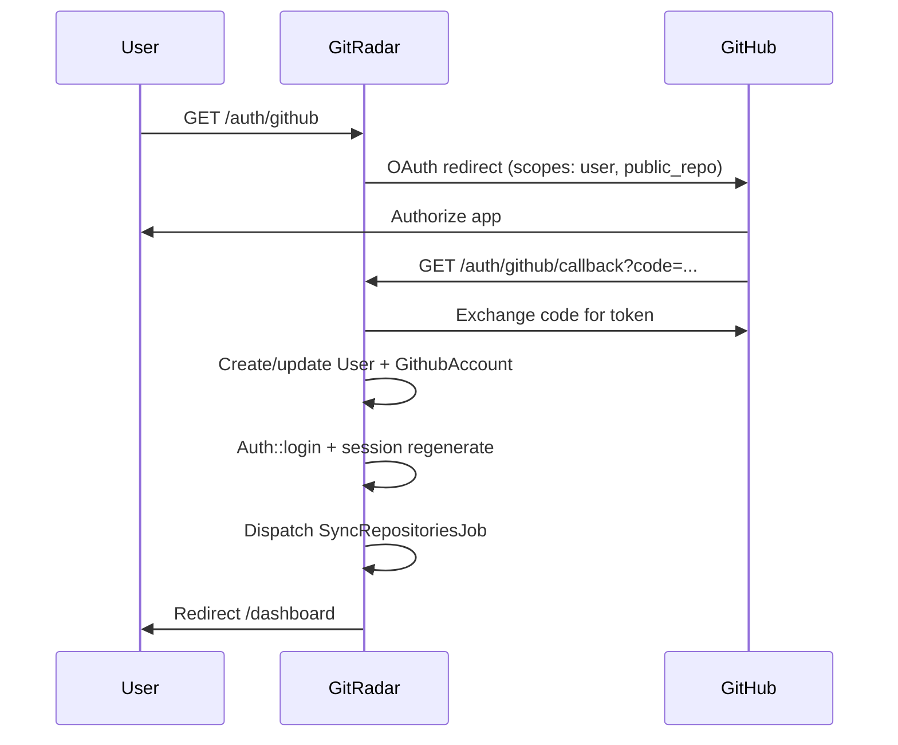

# Authentication

GitRadar uses **GitHub OAuth** via Laravel Socialite. There is no email/password registration flow for end users.

## Flow



## Routes

| Method | Path | Name | Auth |
|--------|------|------|------|
| GET | `/auth/github` | `github.login` | Public |
| GET | `/auth/github/callback` | `github.callback` | Public (throttle: 10/min) |
| GET | `/login` | `login` | Redirects to GitHub login |
| POST | `/logout` | `logout` | Authenticated |

## Controller

`App\Http\Controllers\Auth\GitHubController`:

- **`redirect()`** — Socialite with scopes `user`, `public_repo`
- **`callback()`** — handles token exchange, user upsert, login, sync dispatch

### User creation

```php
User::firstOrCreate(
    ['email' => $githubUser->getEmail() ?? $githubUser->getNickname() . '@github.invalid'],
    ['name' => ..., 'password' => bcrypt(Str::random(40))]
);
```

### GitHub account upsert

Token and profile fields are stored on `GithubAccount` keyed by `github_id`.

### Security measures

- Session regeneration after login (prevents fixation)
- OAuth callback throttled to 10 requests/minute
- Logout via POST only (CSRF protected)
- Invalid OAuth state returns user-friendly error on landing page

## Session

Default driver: `database` (see `SESSION_DRIVER` in `.env`).

Authenticated routes use the `auth` middleware group in `routes/web.php`.

## Authorization (Resources)

Authentication proves identity; **authorization** for repositories uses `RepositoryPolicy`:

| Ability | Rule |
|---------|------|
| `view` | Repository belongs to user's GitHub account |
| `analyze` | Same ownership check |
| `update` | Same (pin/feature toggles) |

Controllers call `$this->authorize('view', $repository)` etc.

## GitHub OAuth App Setup

1. Go to https://github.com/settings/developers
2. New OAuth App
3. Set callback URL to match `GITHUB_REDIRECT_URI`

```env
GITHUB_CLIENT_ID=your_github_client_id
GITHUB_CLIENT_SECRET=your_github_client_secret
GITHUB_REDIRECT_URI=http://localhost:8000/auth/github/callback
```

`APP_URL` must use the same host/port as the redirect URI.

## Scopes

| Scope | Purpose |
|-------|---------|
| `user` | Profile metadata (name, avatar, email) |
| `public_repo` | List and read public repositories + READMEs |

Private repositories are not synced (`visibility=public` in GitHub API calls).

## Logout

`SettingsController::logout()`:

1. `Auth::logout()`
2. Session invalidate + token regenerate
3. Redirect to `/`

## Related Docs

- [github-integration.md](github-integration.md)
- [security.md](security.md)
- [api.md](api.md)
